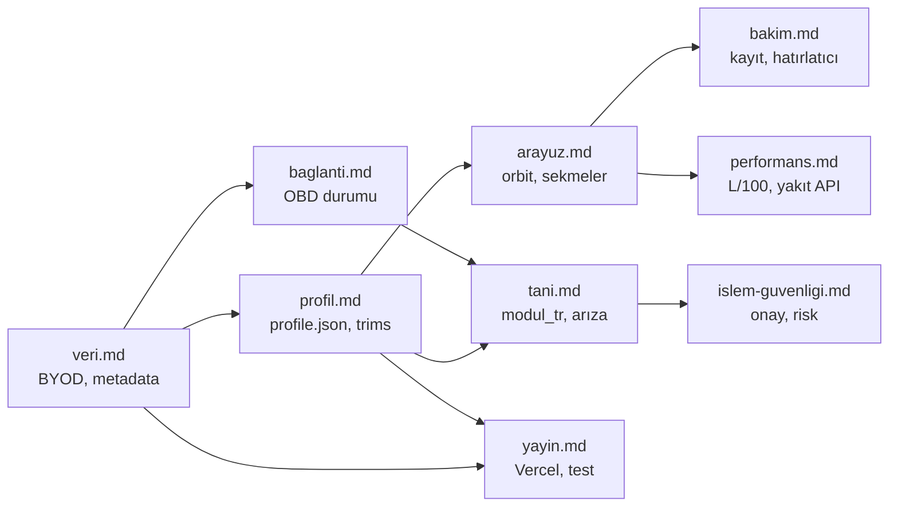

# SüperAraç standart ekosistemi

Tek giriş kapısı: tüm ürün, veri ve yayın kuralları buradan birbirine bağlanır. Uygulama kodu `js/`, kamu metadata `metadata/`, profil şablonları `data/vehicles/`.

## Ekosistem (bağımlılık)

## Standart tablosu

| Standart | Dosya | Modül / route |
|----------|--------|----------------|
| Veri ve BYOD | [docs/standartlar/veri.md](docs/standartlar/veri.md) | `#/ayarlar` (Veri yönetimi), `metadata/`, `data/vehicles/` |
| Profil ve katalog | [docs/standartlar/profil.md](docs/standartlar/profil.md) | `metadata/_index.json`, `js/vehicleMetadata.js`, `#/ariza` |
| Tanı ve arıza | [docs/standartlar/tani.md](docs/standartlar/tani.md) | `#/tara`, `#/ariza`, `#/gizli` |
| Arayüz | [docs/standartlar/arayuz.md](docs/standartlar/arayuz.md) | `#/`, alt sekme çubuğu, orbit |
| Bakım | [docs/standartlar/bakim.md](docs/standartlar/bakim.md) | `#/bakim`, `#/hatirlaticilar` |
| Performans | [docs/standartlar/performans.md](docs/standartlar/performans.md) | `#/yakit`, `#/masraf`, `#/ozet`, `#/performans` |
| Bağlantı (OBD) | [docs/standartlar/baglanti.md](docs/standartlar/baglanti.md) | Ana sayfa OBD pill, tanı simülasyonu |
| İşlem güvenliği | [docs/standartlar/islem-guvenligi.md](docs/standartlar/islem-guvenligi.md) | Silme onayları, `riskTr`, gelecek audit |
| Yayın | [docs/standartlar/yayin.md](docs/standartlar/yayin.md) | `main`, Vercel, `npm test` |

## Önerilen okuma sırası

1. **Veri** — ne repoda, ne cihazda; BYOD sınırları  
2. **Profil** — yeni paket ekleme, Megane örneği  
3. **Bağlantı** — OBD’nin bugünkü durumu  
4. **Tanı** — modül adları, arıza kaydı, simülasyon  
5. **İşlem güvenliği** — yazma/silme onayları  
6. **Arayüz** — orbit, sekmeler, Türkçe metin  
7. **Bakım** ve **Performans** — kullanıcı kayıtları  
8. **Yayın** — merge ve canlı site  

## Kök yönlendirmeler

- `VERI_STANDARTLARI.md` → tam metin: [docs/standartlar/veri.md](docs/standartlar/veri.md)  
- `metadata/README.md`, `data/vehicles/README.md` → bu dosya + ilgili alt sayfa  

**Repo:** https://github.com/ykslaksoy/arac-ozellik-bakim
